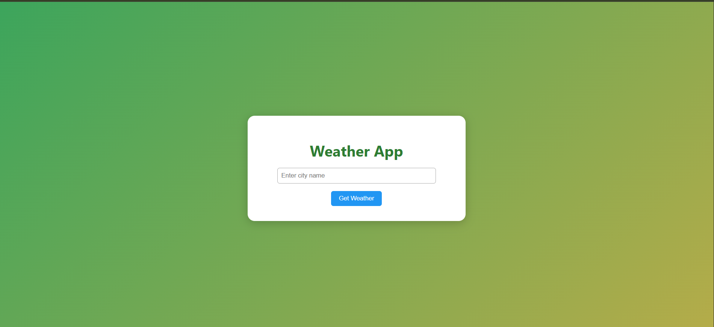

<div align="center">

#  Weather App

### Real-Time Weather Intelligence • Minimal UI • Production Ready

<p>
A lightweight and scalable weather web application that delivers real-time weather insights for any city worldwide using a clean and responsive interface.
</p>

<br/>

<a href="https://weather-app-043d.onrender.com" target="_blank">
  
</a>

<br/><br/>


</div>

---

## Overview

**Weather App** is a minimal yet powerful Flask-based web application that fetches and displays real-time weather data using the OpenWeatherMap API.

It focuses on simplicity, performance, and clarity — delivering accurate weather information in a clean card-based interface without unnecessary complexity.

---

## Screenshots

<div align="center">

| Home Interface | Weather Output |
|---------------|----------------|
|  |  |

</div>

---

## Key Features

- Real-time weather data for any city worldwide  
- Temperature conversion (Kelvin to Celsius)  
- Displays humidity, wind speed, and conditions  
- Dynamic weather icons from API  
- Local time calculation using timezone offset  
- Clean and responsive UI design  
- Robust error handling (invalid city, API issues)  
- Production-ready deployment using Gunicorn  

---

## Technology Stack

<div align="center">

| Category | Technology |
|----------|-----------|
| Backend |  Python |
| Framework |  Flask |
| Styling |  CSS |
| API |  OpenWeatherMap |
| Environment |  python-dotenv |
| Server |  Gunicorn |
| Hosting |  Render |

</div>
<!-- | Templating |  Jinja2 | -->

---

## Project Structure

```
weather_app/
├── app.py
├── requirements.txt
├── .env
├── .env.example
├── .gitignore
├── static/
│   └── style.css
├── templates/
│   └── index.html
└── assets/
    ├── home.png
    └── output.png
```

---

## Getting Started

### Prerequisites

- Python 3.8 or higher  
- OpenWeatherMap API key  

---

### Installation

```bash
git clone https://github.com/priyanildz/Weather_app.git
cd Weather_app
```

```bash
python -m venv venv
```

```bash
# Windows
venv\Scripts\activate

# macOS/Linux
source venv/bin/activate
```

```bash
pip install -r requirements.txt
```

---

### Environment Setup

```bash
cp .env.example .env
```

Update `.env`:

```env
OPENWEATHER_API_KEY=your_api_key_here
```

---

### Run Application

```bash
python app.py
```

Open:

```
http://127.0.0.1:5000
```

---

## Usage Flow

1. Enter a city name  
2. Submit request  
3. View:
   - Temperature  
   - Humidity  
   - Wind speed  
   - Weather condition  
   - Local time  

---

## API Integration

```
GET https://api.openweathermap.org/data/2.5/weather?q={city}&appid={API_KEY}
```

### Data Used

- Temperature  
- Humidity  
- Wind Speed  
- Weather Description  
- Weather Icon  
- Timezone Offset  

---

## Deployment

### Production Server

```bash
gunicorn app:app
```

### Render Deployment

- Create new web service  
- Connect repository  
- Set start command:

```
gunicorn app:app
```

- Add environment variable:

```
OPENWEATHER_API_KEY
```

---

## Contributing

1. Fork the repository  
2. Create a feature branch  
3. Commit your changes  
4. Push to GitHub  
5. Open a pull request  

---

## License

This project is licensed under the MIT License.

---

<div align="center">

Developed by  
<strong>priyanildz</strong>

</div>